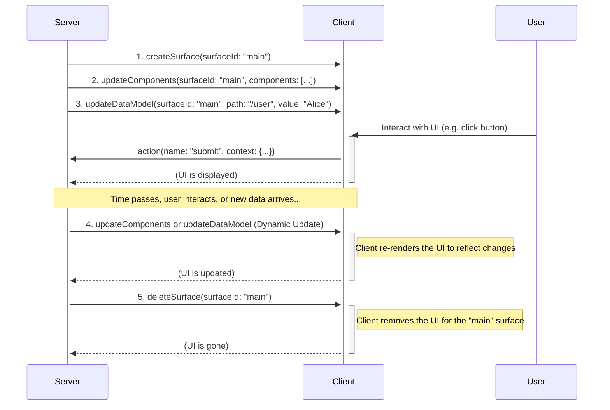
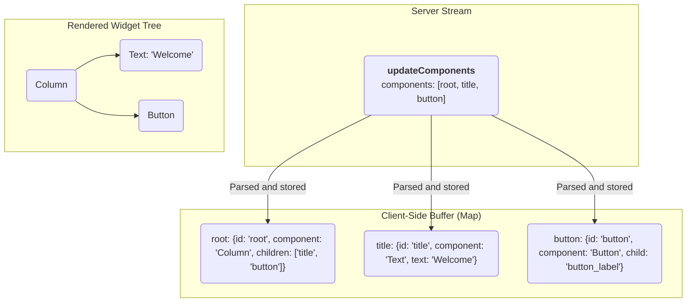

A Specification for a JSON-Based, Streaming UI Protocol.

**Version:** 0.9
**Status:** Draft
**Created:** Nov 20, 2025
**Last Updated:** Dec 3, 2025

A Specification for a JSON-Based, Streaming UI Protocol

## Introduction

The A2UI Protocol is designed for dynamically rendering user interfaces from a stream of JSON objects sent from a server (Agent). Its core philosophy emphasizes a clean separation of UI structure and application data, enabling progressive rendering as the client processes each message.

Communication occurs via a stream of JSON objects. The client parses each object as a distinct message and incrementally builds or updates the UI. The server-to-client protocol defines four message types:

- `createSurface`: Signals the client to create a new surface and begin rendering it.
- `updateComponents`: Provides a list of component definitions to be added to or updated in a specific surface.
- `updateDataModel`: Provides new data to be inserted into or to replace a surface's data model.
- `deleteSurface`: Explicitly removes a surface and its contents from the UI.

## Changes from previous versions

Version 0.9 of the A2UI protocol represents a philosophical shift from previous versions. While v0.8 was optimized for LLMs that support structured output, v0.9 is designed to be embedded directly within a model's prompt. The LLM is then asked to produce JSON that matches the provided examples and schema descriptions.

This "prompt-first" approach offers several advantages:

1.  **Richer schema:** The protocol is no longer limited by the constraints of structured output formats. This allows for more readable, complex, and expressive component catalogs.
2.  **Modularity:** The schema is now refactored into separate, more manageable components (e.g., [`common_types.json`], [`standard_catalog.json`], [`server_to_client.json`]), improving maintainability and modularity.

The main disadvantage of this approach is that it requires more complex post-generation validation, as the LLM is not strictly constrained by the schema. This requires robust error handling and correction, so the system can identify discrepancies and attempt to fix them before rendering, or request a retry or correction from the LLM.

See [the evolution guide](evolution_guide.md) for a detailed explanation of the differences between v0.8 and v0.9.

## Protocol overview & data flow

The A2UI protocol uses a unidirectional stream of JSON messages from the server to the client to describe and update the UI. The client consumes this stream, builds the UI, and renders it. User interactions are handled separately, typically by sending events to a different endpoint, which may in turn trigger new messages on the UI stream.

Here is an example sequence of events (which don't have to be in exactly this order):

1.  **Create Surface:** The server sends a `createSurface` message to initialize the surface.
2.  **Update Surface:** Once a surface has been created, the server sends one or more `updateComponents` messages containing the definitions for all the components that will be part of the surface.
3.  **Update Data Model:** Once a surface has been created, the server can send `updateDataModel` messages at any time to populate or change the data that the UI components will display.
4.  **Render:** The client renders the UI for the surface, using the component definitions to build the structure and the data model to populate the content.
5.  **Dynamic updates:** As the user interacts with the application or as new information becomes available, the server can send additional `updateComponents` and `updateDataModel` messages to dynamically change the UI.
6.  **Delete Surface:** When a UI region is no longer needed, the server sends a `deleteSurface` message to remove it.



## Transport decoupling

The A2UI protocol is designed to be transport-agnostic. It defines the JSON message structure and the semantic contract between the server (Agent) and the client (Renderer), but it does not mandate a specific transport layer.

### The transport contract

To support A2UI, a transport layer must fulfill the following contract:

1.  **Reliable delivery**: Messages must be delivered in the order they were generated. A2UI relies on stateful updates (e.g., creating a surface before updating it), so out-of-order delivery can corrupt the UI state.
2.  **Message framing**: The transport must clearly delimit individual JSON envelope messages (e.g., using newlines in JSONL, WebSocket frames, or SSE events).
3.  **Metadata support**: The transport must provide a mechanism to associate metadata with messages. This is critical for:
    - **Data model synchronization**: The `sendDataModel` feature requires the client to send the current data model state as metadata alongside user actions.
    - **Capabilities exchange**: Client capabilities (supported catalogs, custom components) are exchanged via metadata.
4.  **Bidirectional capability (optional)**: While the rendering stream is unidirectional (Server -> Client), interactive applications require a return channel for `action` messages (Client -> Server).

### Transport bindings

While A2UI is agnostic, it is most commonly used with the following transports.

#### A2A (Agent2Agent) binding

[A2A (Agent-to-Agent)](https://a2a-protocol.org/latest/) is an excellent transport option for A2UI in agentic systems, extending A2A with additional payloads.
A2A is uniquely capable of handling remote agent communication, and can also provide a secure and effecient transport between an agentic backend and front end application.

- **Message mapping**: Each A2UI envelope (e.g., `updateComponents`) corresponds to the payload of a single A2A message Part.
- **Metadata**:
  - **Data model**: When `sendDataModel` is active, the client's `a2uiClientDataModel` object is placed in the `metadata` field of the A2A message.
  - **Capabilities**: The `a2uiClientCapabilities` object is placed in the `metadata` field of every A2A message sent from the client to the server.
- **Context**: A2UI sessions typically map to A2A `contextId`. All messages for a set of related surfaces should share the same `contextId`.

#### AG UI (Agent to User Interface) binding

**[AG-UI](https://docs.ag-ui.com/introduction)** is also an excellent transport option for A2UI Agent–User Interaction protocol.
AG UI provides convenient integrations into many agent frameworks and frontends. AG UI provides low latency and shared state message passing between front ends and agentic backends.

#### Other transports

A2UI can also be carried over:

- **[MCP (Model Context Protocol)](https://modelcontextprotocol.io/docs/getting-started/intro)**: Delivered as tool outputs or resource subscriptions.
- **[SSE](https://en.wikipedia.org/wiki/Server-sent_events) with [JSON RPC](https://www.jsonrpc.org/)**: Standard server-sent events for web integrations that support streaming, and JSON RPC for client-server communication.
- **[WebSockets](https://en.wikipedia.org/wiki/WebSocket)**: For bidirectional, real-time sessions.
- **[REST](https://cloud.google.com/discover/what-is-rest-api?hl=en)**: For simple use case, REST APIs will work but lack streaming capabilities.

## The protocol schemas

A2UI v0.9 is defined by three interacting JSON schemas.

### Common types

The [`common_types.json`] schema defines reusable primitives used throughout the protocol.

- **`DynamicString` / `DynamicNumber` / `DynamicBoolean` / `DynamicStringList`**: The core of the data binding system. Any property that can be bound to data is defined as a `Dynamic*` type. It accepts either a literal value, a `path` string ([JSON Pointer]), or a `FunctionCall` (function call).
- **`ChildList`**: Defines how containers hold children. It supports:
  - `array`: A static array of `ComponentId` component references.
  - `object`: A template for generating children from a data binding list (requires a template `componentId` and a data binding `path`).

- **`ComponentId`**: A reference to the unique ID of another component within the same surface.

### Server to client message structure: the envelope

The [`server_to_client.json`] schema is the top-level entry point. Every message streamed by the server must validate against this schema. It handles the message dispatching.

### The Standard Catalog

The [`standard_catalog.json`] schema contains the definitions for all specific UI components (e.g., `Text`, `Button`, `Row`) and functions (e.g., `required`, `email`).

**Swappable Catalogs & Validation:**

The [`server_to_client.json`] envelope schema is designed to be catalog-agnostic. It references components using a placeholder filename: `catalog.json` (specifically `$ref: "catalog.json#/$defs/anyComponent"`).

To validate A2UI messages:

1.  **Standard Catalog**: Map `catalog.json` to `standard_catalog.json`.
2.  **Custom Catalog**: Map `catalog.json` to your custom catalog file (e.g., `my_custom_catalog.json`).

This indirection allows the same core envelope schema to be used with any compliant component catalog without modification.

Custom catalogs can be used to define additional UI components or modify the behavior of existing components. To use a custom catalog, simply include it in the prompt in place of the standard catalog. It should have the same form as the standard catalog, and use common elements in the [`common_types.json`] schema.

### Validator compliance & custom catalogs

To ensure that automated validators can verify the integrity of your UI tree (checking that parents reference existing children), custom catalogs MUST adhere to the following strict typing rules:

1.  **Single child references:** Any property that holds the ID of another component MUST use the `ComponentId` type defined in `common_types.json`.
    - Use: `"$ref": "common_types.json#/$defs/ComponentId"`
    - Do NOT use: `"type": "string"`

2.  **List references:** Any property that holds a list of children or a template MUST use the `ChildList` type.
    - Use: `"$ref": "common_types.json#/$defs/ChildList"`

Validators determine which fields represent structural links by looking for these specific schema references. If you use a raw string type for an ID, the validator will treat it as static text (like a URL or label) and will not check if the target component exists.

## Envelope message structure

The envelope defines four primary message types, and every message streamed by the server must be a JSON object containing exactly one of the following keys: `createSurface`, `updateComponents`, `updateDataModel`, or `deleteSurface`. The key indicates the type of message, and these are the messages that make up each message in the protocol stream.

### `createSurface`

This message signals the client to create a new surface and begin rendering it. A surface must be created before any `updateComponents` or `updateDataModel` messages can be sent to it. While typically achieved by the agent sending a `createSurface` message, an agent may skip this if it knows the surface has already been created (e.g., by another agent). Once a surface is created, its `surfaceId` and `catalogId` are fixed; to reconfigure them, the surface must be deleted and recreated. One of the components in one of the component lists MUST have an `id` of `root` to serve as the root of the component tree.

**Properties:**

- `surfaceId` (string, required): The unique identifier for the UI surface to be rendered.
- `catalogId` (string, required): A string that uniquely identifies the catalog (components and functions) used for this surface. It is recommended to prefix this with an internet domain that you own, to avoid conflicts (e.g., `https://mycompany.com/1.0/somecatalog`). If it is a URL, the URL does not need to have any deployed resources, it is simply a unique identifier.
- `theme` (object, optional): A JSON object containing theme parameters (e.g., `primaryColor`) defined in the catalog's theme schema.
- `sendDataModel` (boolean, optional): If true, the client will send the full data model of this surface in the metadata of every message sent to the server (via the Transport's metadata mechanism). This ensures the surface owner receives the full current state of the UI alongside the user's action or query. Defaults to false.

**Example:**

```json
{
  "version": "v0.9",
  "createSurface": {
    "surfaceId": "user_profile_card",
    "catalogId": "https://a2ui.org/specification/v0_9/standard_catalog.json",
    "theme": {
      "primaryColor": "#00BFFF"
    },
    "sendDataModel": true
  }
}
```

### `updateComponents`

This message provides a list of UI components to be added to or updated within a specific surface. The components are provided as a flat list, and their relationships are defined by ID references in an adjacency list. This message may only be sent to a surface that has already been created. Note that components may reference children or data bindings that do not yet exist; clients should handle this gracefully by rendering placeholders (progressive rendering).

**Properties:**

- `surfaceId` (string, required): The unique identifier for the UI surface to be updated. This is typically a name with meaning (e.g. "user_profile_card"), and it has to be unique within the context of the GenUI session.
- `components` (array, required): A list of component objects. The components are provided as a flat list, and their relationships are defined by ID references in an adjacency list.

**Example:**

```json
{
  "version": "v0.9",
  "updateComponents": {
    "surfaceId": "user_profile_card",
    "components": [
      {
        "id": "root",
        "component": "Column",
        "children": ["user_name", "user_title"]
      },
      {
        "id": "user_name",
        "component": "Text",
        "text": "John Doe"
      },
      {
        "id": "user_title",
        "component": "Text",
        "text": "Software Engineer"
      }
    ]
  }
}
```

### `updateDataModel`

This message is used to send or update the data that populates the UI components. It allows the server to change the UI's content without resending the entire component structure. The `updateDataModel` message replaces the value at the specified `path` with the new content. If `path` is omitted (or is `/`), the entire data model for the surface is replaced.

**Properties:**

- `surfaceId` (string, required): The unique identifier for the UI surface this data model update applies to.
- `path` (string, optional): A JSON Pointer to the location in the data model to update. Defaults to `/`.
- `value` (any, optional): The new value for the specified path. If omitted, the key at `path` is removed.

**Example:**

```json
{
  "version": "v0.9",
  "updateDataModel": {
    "surfaceId": "user_profile_card",
    "path": "/user/name",
    "value": "Jane Doe"
  }
}
```

### `deleteSurface`

This message instructs the client to remove a surface and all its associated components and data from the UI.

**Properties:**

- `surfaceId` (string, required): The unique identifier for the UI surface to be deleted.

**Example:**

```json
{
  "version": "v0.9",
  "deleteSurface": {
    "surfaceId": "user_profile_card"
  }
}
```

## Example Stream

The following example demonstrates a complete interaction to render a Contact Form, expressed as a JSONL stream.

```jsonl
{"version": "v0.9", "createSurface":{"surfaceId":"contact_form_1","catalogId":"https://a2ui.org/specification/v0_9/standard_catalog.json"}}
{"version": "v0.9", "updateComponents":{"surfaceId":"contact_form_1","components":[{"id":"root","component":"Card","child":"form_container"},{"id":"form_container","component":"Column","children":["header_row","name_row","email_group","phone_group","pref_group","divider_1","newsletter_checkbox","submit_button"],"justify":"start","align":"stretch"},{"id":"header_row","component":"Row","children":["header_icon","header_text"],"align":"center"},{"id":"header_icon","component":"Icon","name":"mail"},{"id":"header_text","component":"Text","text":"# Contact Us","variant":"h2"},{"id":"name_row","component":"Row","children":["first_name_group","last_name_group"],"justify":"spaceBetween"},{"id":"first_name_group","component":"Column","children":["first_name_label","first_name_field"],"weight":1},{"id":"first_name_label","component":"Text","text":"First Name","variant":"caption"},{"id":"first_name_field","component":"TextField","label":"First Name","value":{"path":"/contact/firstName"},"variant":"shortText"},{"id":"last_name_group","component":"Column","children":["last_name_label","last_name_field"],"weight":1},{"id":"last_name_label","component":"Text","text":"Last Name","variant":"caption"},{"id":"last_name_field","component":"TextField","label":"Last Name","value":{"path":"/contact/lastName"},"variant":"shortText"},{"id":"email_group","component":"Column","children":["email_label","email_field"]},{"id":"email_label","component":"Text","text":"Email Address","variant":"caption"},{"id":"email_field","component":"TextField","label":"Email","value":{"path":"/contact/email"},"variant":"shortText","checks":[{"call":"required","args":{"value":{"path":"/contact/email"}},"message":"Email is required."},{"call":"email","args":{"value":{"path":"/contact/email"}},"message":"Please enter a valid email address."}]},{"id":"phone_group","component":"Column","children":["phone_label","phone_field"]},{"id":"phone_label","component":"Text","text":"Phone Number","variant":"caption"},{"id":"phone_field","component":"TextField","label":"Phone","value":{"path":"/contact/phone"},"variant":"shortText","checks":[{"call":"regex","args":{"value":{"path":"/contact/phone"},"pattern":"^\\d{10}$"},"message":"Phone number must be 10 digits."}]},{"id":"pref_group","component":"Column","children":["pref_label","pref_picker"]},{"id":"pref_label","component":"Text","text":"Preferred Contact Method","variant":"caption"},{"id":"pref_picker","component":"ChoicePicker","variant":"mutuallyExclusive","options":[{"label":"Email","value":"email"},{"label":"Phone","value":"phone"},{"label":"SMS","value":"sms"}],"value":{"path":"/contact/preference"}},{"id":"divider_1","component":"Divider","axis":"horizontal"},{"id":"newsletter_checkbox","component":"CheckBox","label":"Subscribe to our newsletter","value":{"path":"/contact/subscribe"}},{"id":"submit_button_label","component":"Text","text":"Send Message"},{"id":"submit_button","component":"Button","child":"submit_button_label","variant":"primary","action":{"event":{"name":"submitContactForm","context":{"formId":"contact_form_1","clientTime":{"call":"formatDate","args":{"value": "2026-02-02T15:17:00Z", "format": "E MMM d, YYYY h:mm a"},"returnType":"string"},"isNewsletterSubscribed":{"path":"/contact/subscribe"}}}}}]}}
{"version": "v0.9", "updateDataModel":{"surfaceId":"contact_form_1","path":"/contact","value":{"firstName":"John","lastName":"Doe","email":"john.doe@example.com","phone":"1234567890","preference":["email"],"subscribe":true}}}
{"version": "v0.9", "deleteSurface":{"surfaceId":"contact_form_1"}}
```

## Component model

A2UI's component model is designed for flexibility, separating the protocol's structure from the set of available UI components.

### The component object

Each object in the `components` array of an `updateComponents` message defines a single UI component. It has the following structure:

- `id` (`ComponentId`, required): A unique string that identifies this specific component instance. This is used for parent-child references.
- `component` (string, required): Specifies the component's type (e.g., `"Text"`).
- **Component Properties**: Other properties relevant to the specific component type (e.g., `text`, `url`, `children`) are included directly in the component object.

This structure is designed to be both flexible and strictly validated.

### The component catalog

The set of available UI components and functions is defined in a **Catalog**. The standard catalog is defined in [`standard_catalog.json`]. This allows for different clients to support different sets of components and functions, including custom ones. Advanced use cases may want to define their own custom catalogs to support custom front end design systems or renderers. The server must generate messages that conform to the catalog understood by the client.

### UI composition: the adjacency list model

The A2UI protocol defines the UI as a flat list of components. The tree structure is built implicitly using ID references. This is known as an adjacency list model.

Container components (like `Row`, `Column`, `List`, and `Card`) have properties that reference the `id` of their child component(s). The client is responsible for storing all components in a map (e.g., `Map<String, Component>`) and recreating the tree structure at render time.

This model allows the server to send component definitions in any order. Rendering can begin as soon as the `root` component is defined, with the client filling in or updating the rest of the tree progressively as additional definitions arrive.

There must be exactly one component with the ID `root` in the component tree, acting as the root of the component tree. Until that component is defined, other component updates will have no visible effect, and they will be buffered until a root component is defined. Once a root component is defined, the client is responsible for rendering the tree in the best way possible based on the available data, skipping invalid references.



### Defining actions

Interactive components (like `Button`) use an `action` property to define what happens when the user interacts with them. Actions can either trigger an event sent to the server or execute a local client-side function.

#### Server actions

To send an event to the server, use the `event` property within the `action` object. It requires a `name` and an optional `context`.

```json
{
  "component": "Button",
  "text": "Submit",
  "action": {
    "event": {
      "name": "submit_form",
      "context": {
        "itemId": "123"
      }
    }
  }
}
```

#### Local actions

To execute a local function, use the `functionCall` property within the `action` object. This property references a standard `FunctionCall` object.

```json
{
  "component": "Button",
  "text": "Open Link",
  "action": {
    "functionCall": {
      "call": "openUrl",
      "args": {
        "url": "${/url}"
      }
    }
  }
}
```

## Data model representation: binding, scope

This section describes how UI components **represent** and reference data from the Data Model. A2UI relies on a strictly defined relationship between the UI structure (Components) and the state (Data Model), defining the mechanics of path resolution, variable scope during iteration.

### Path resolution & scope

Data bindings in A2UI are defined using **JSON Pointers** ([RFC 6901]). How a pointer is resolved depends on the current **Evaluation Scope**.

> **Note on progressive rendering:** During the initial streaming phase, data paths may resolve to `undefined` if the `updateDataModel` message containing that data has not yet arrived. Renderers should handle `undefined` values gracefully (e.g., by treating them as empty strings or showing a loading indicator) to support progressive rendering.

#### The root scope

By default, all components operate in the **Root Scope**.

- Paths starting with `/` (e.g., `/user/profile/name`) are **Absolute Paths**. They always resolve from the root of the Data Model, regardless of where the component is nested in the UI tree.

#### Collection scopes (relative paths)

When a container component (such as `Column`, `Row`, or `List`) utilizes the **Template** feature of `ChildList`, it creates a new **Child Scope** for each item in the bound array.

- **Template definition:** When a container binds its children to a path (e.g., `path: "/users"`), the client iterates over the array found at that location.
- **Scope instantiation:** For every item in the array, the client instantiates the template component.
- **Relative resolution:** Inside these instantiated components, any path that **does not** start with a forward slash `/` is treated as a **Relative Path**.
  - A relative path `firstName` inside a template iterating over `/users` resolves to `/users/0/firstName` for the first item, `/users/1/firstName` for the second, etc.

- **Mixing scopes:** Components inside a Child Scope can still access the Root Scope by using an Absolute Path.

#### Example: scope resolution

**Data model:**

```json
{
  "company": "Acme Corp",
  "employees": [
    { "name": "Alice", "role": "Engineer" },
    { "name": "Bob", "role": "Designer" }
  ]
}
```

**Component definition:**

```json
{
  "id": "employee_list",
  "component": "List",
  "children": {
    "path": "/employees",
    "componentId": "employee_card_template"
  }
},
{
  "id": "employee_card_template",
  "component": "Column",
  "children": ["name_text", "company_text"]
},
{
  "id": "name_text",
  "component": "Text",
  "text": { "path": "name" }
  // "name" is Relative. Resolves to /employees/N/name
},
{
  "id": "company_text",
  "component": "Text",
  "text": { "path": "/company" }
  // "/company" is Absolute. Resolves to "Acme Corp" globally.
}
```

#### Type conversion

When a non-string value is interpolated, the client converts it to a string:

- **Numbers/Booleans**: Standard string representation.
- **null/undefined**: An empty string `""`.
- **Objects/Arrays**: Stringified as JSON to ensure consistency across different client implementations.

### Two-way binding & input components

Interactive components that accept user input (`TextField`, `CheckBox`, `Slider`, `ChoicePicker`, `DateTimeInput`) establish a **Two-Way Binding** with the Data Model.

#### The read/write contract

Unlike static display components (like `Text`), input components modify the client-side data model immediately upon user interaction.

1.  **Read (Model -> View):** When the component renders, it reads its value from the bound `path`. If the Data Model is updated via `updateDataModel`, the component re-renders to reflect the new value.
2.  **Write (View -> Model):** When the user interacts with the component (e.g., types a character, toggles a box), the client **immediately** updates the value at the bound `path` in the local Data Model.

#### Reactivity

Because the local Data Model is the single source of truth, updates from input components are **reactive**.

- If a `TextField` is bound to `/user/name`, and a separate `Text` label is also bound to `/user/name`, the label must update in real-time as the user types in the text field.

#### Server synchronization

It is critical to note that Two-Way Binding is **local to the client**.

- User inputs (keystrokes, toggles) do **not** automatically trigger network requests to the server.
- The updated state is sent to the server only when a specific **User Action** is triggered (e.g., a `Button` click).
- When an `action` is dispatched, the `context` property of the action can reference the modified data paths to send the user's input back to the server.

#### Example: form submission pattern

1.  **Bind:** `TextField` is bound to `/formData/email`.
2.  **Interact:** User types "jane@example.com". The local model at `/formData/email` is updated.
3.  **Action:** A "Submit" button has the following action definition:

    ```json
    "action": {
      "event": {
        "name": "submit_form",
        "context": {
          "email": { "path": "/formData/email" }
        }
      }
    }
    ```

4.  **Send:** When clicked, the client resolves `/formData/email` (getting "jane@example.com") and sends it in the `action` payload.

## Data model updates: synchronization and convergence

While the sections above describe how components reference data, this section defines how the Data Model itself is **updated** and synchronized.

To support reliable data synchronization between the Renderer and the Agent that created the surface, the A2UI protocol uses a simple synchronization mechanism controlled by the `sendDataModel` property in the `createSurface` message.

### Server to client updates

The server sends `updateDataModel` messages to modify the client's data model. These updates follow strict upsert semantics:

- If the path exists, the value is updated.
- If the path does not exist, the value is created.
- If the value is `null`, the key at that path is removed.

The `updateDataModel` message replaces the value at the specified `path` with the new content. If `path` is omitted (or is `/`), the entire data model for the surface is replaced.

**Properties:**

- `surfaceId` (string, required): The ID of the surface to update.
- `path` (string, optional): A JSON Pointer to the location in the data model to update. Defaults to `/`.
- `value` (any, optional): The new value for the specified path. If omitted, the key at `path` is removed.

**Examples:**

_Update a specific field:_

```json
{
  "version": "v0.9",
  "updateDataModel": {
    "surfaceId": "surface_123",
    "path": "/user/firstName",
    "value": "Alice"
  }
}
```

_Remove a field:_

```json
{
  "version": "v0.9",
  "updateDataModel": {
    "surfaceId": "surface_123",
    "path": "/user/tempData"
  }
}
```

_Replace the entire data model:_

```json
{
  "version": "v0.9",
  "updateDataModel": {
    "surfaceId": "surface_123",
    "value": {
      "user": { "firstName": "Alice", "lastName": "Smith" },
      "preferences": { "theme": "dark" }
    }
  }
}
```

### Client to server updates

When `sendDataModel` is set to `true` for a surface, the client automatically appends the **entire data model** of that surface to the metadata of every message (such as `action` or user query) sent to the server that created the surface. The data model is included using the transport's metadata facility (e.g., the `metadata` field in A2A or a header in HTTP). The payload follows the schema in [`a2ui_client_data_model.json`](../json/a2ui_client_data_model.json).

- **Targeted Delivery**: The data model is sent exclusively to the server that created the surface. Data cannot leak to other agents or servers.
- **Trigger:** Data is sent only when a client-to-server message is triggered (e.g., by a user action like a button click). Passive data changes (like typing in a text field) do not trigger a network request on their own; they simply update the local state, which will be sent with the next action.
- **Payload:** The data model is included in the transport metadata, tagged by its `surfaceId`.
- **Convergence:** The server treats the received data model as the current state of the client at the time of the action.

## Client-side logic & validation

A2UI v0.9 generalizes client-side logic into **Functions**. These can be used for validation, data transformation, and dynamic property binding.

### Registered functions

The client supports a set of named **Functions** (e.g., `required`, `regex`, `email`, `add`, `concat`) which are defined in the JSON schema (e.g. `standard_catalog.json`) alongside the component definitions. The server references these functions by name in `FunctionCall` objects. This avoids sending executable code.

Input components (like `TextField`, `CheckBox`) can define a list of checks. Each failure produces a specific error message that can be displayed when the component is rendered. Note that for validation checks, the function must return a boolean.

```json
"checks": [
  {
    "call": "required",
    "args": { "value": { "path": "/formData/zip" } },
    "message": "Zip code is required"
  },
  {
    "call": "regex",
    "args": {
      "value": { "path": "/formData/zip" },
      "pattern": "^[0-9]{5}$"
    },
    "message": "Must be a 5-digit zip code"
  }
]
```

### Example: button validation

Buttons can also define `checks`. If any check fails, the button is automatically disabled. This allows the button's state to depend on the validity of data in the model.

```json
{
  "component": "Button",
  "text": "Submit",
  "checks": [
    {
      "condition": {
        "call": "and",
        "args": {
          "values": [
            {
              "call": "required",
              "args": { "value": { "path": "/formData/terms" } }
            },
            {
              "call": "or",
              "args": {
                "values": [
                  {
                    "call": "required",
                    "args": { "value": { "path": "/formData/email" } }
                  },
                  {
                    "call": "required",
                    "args": { "value": { "path": "/formData/phone" } }
                  }
                ]
              }
            }
          ]
        }
      },
      "message": "You must accept terms AND provide either email or phone"
    }
  ]
}
```

## Standard Component Catalog

The [`standard_catalog.json`] provides the baseline set of components and functions.

### Components

| Component         | Description                                                                                 |
| :---------------- | :------------------------------------------------------------------------------------------ |
| **Text**          | Displays text. Supports simple Markdown.                                                    |
| **Image**         | Displays an image from a URL.                                                               |
| **Icon**          | Displays a system-provided icon from a predefined list.                                     |
| **Video**         | Displays a video from a URL.                                                                |
| **AudioPlayer**   | A player for audio content from a URL.                                                      |
| **Row**           | A horizontal layout container.                                                              |
| **Column**        | A vertical layout container.                                                                |
| **List**          | A scrollable list of components.                                                            |
| **Card**          | A container with card-like styling.                                                         |
| **Tabs**          | A set of tabs, each with a title and child component.                                       |
| **Divider**       | A horizontal or vertical dividing line.                                                     |
| **Modal**         | A dialog that appears over the main content triggered by a button in the main content.      |
| **Button**        | A clickable button that dispatches an action. Supports 'primary' and 'borderless' variants. |
| **CheckBox**      | A checkbox with a label and a boolean value.                                                |
| **TextField**     | A field for user text input.                                                                |
| **DateTimeInput** | An input for date and/or time.                                                              |
| **ChoicePicker**  | A component for selecting one or more options.                                              |
| **Slider**        | A slider for selecting a numeric value within a range.                                      |

### Functions

| Function           | Description                                                              |
| :----------------- | :----------------------------------------------------------------------- |
| **required**       | Checks that the value is not null, undefined, or empty.                  |
| **regex**          | Checks that the value matches a regular expression string.               |
| **length**         | Checks string length constraints.                                        |
| **numeric**        | Checks numeric range constraints.                                        |
| **email**          | Checks that the value is a valid email address.                          |
| **formatString**   | Does string interpolation of data model values and registered functions. |
| **formatNumber**   | Formats a number with grouping and precision.                            |
| **formatCurrency** | Formats a number as a currency string.                                   |
| **formatDate**     | Formats a date/time using a pattern.                                     |
| **pluralize**      | Selects a localized string based on a numeric count.                     |
| **openUrl**        | Opens a URL in a browser.                                                |
| **and**            | Logical AND operation on a list of boolean values.                       |
| **or**             | Logical OR operation on a list of boolean values.                        |
| **not**            | Logical NOT operation on a boolean value.                                |

### Theme

The standard catalog defines the following theme properties that can be set in the `createSurface` message:

| Property             | Type   | Description                                                                                                                                                                                                               |
| :------------------- | :----- | :------------------------------------------------------------------------------------------------------------------------------------------------------------------------------------------------------------------------ |
| **primaryColor**     | String | The primary brand color used for highlights throughout the UI (e.g., primary buttons, active borders). The renderer may generate variants, such as lighter shades, as needed. Format: Hexadecimal code (e.g., '#00BFFF'). |
| **iconUrl**          | URI    | A URL for an image (e.g., logo or avatar) that identifies the agent or tool associated with the surface.                                                                                                                  |
| **agentDisplayName** | String | Text to be displayed next to the surface to identify the agent or tool that created it (e.g. "Weather Bot").                                                                                                              |

#### Identity and attribution

The `iconUrl` and `agentDisplayName` fields are used to provide attribution to the user, identifying which sub-agent or tool is responsible for a particular UI surface.

In multi-agent systems or orchestrators, the orchestrator is responsible for setting or validating these fields. This ensures that the identity displayed to the user matches the actual agent server being contacted, preventing malicious agents from impersonating trusted services. For example, an orchestrator might overwrite these fields with the verified identity of the sub-agent before forwarding the `createSurface` message to the client.

### The `formatString` function

The `formatString` function supports embedding dynamic expressions directly within string properties. This allows for mixing static text with data model values and function results.

#### `formatString` syntax

Interpolated expressions are enclosed in `${...}`. To include a literal `${` in a string, it must be escaped as `\${`.

#### `formatString` data model binding

Values from the data model can be interpolated using their JSON Pointer path.

- `${/user/profile/name}`: Absolute path.
- `${firstName}`: Relative path (resolved against the current collection scope).

**Example:**

```json
{
  "id": "user_welcome",
  "component": "Text",
  "text": {
    "call": "formatString",
    "args": {
      "value": "Hello, ${/user/firstName}! Welcome back to ${/appName}."
    }
  }
}
```

#### `formatString` client-side functions

Results of client-side functions can be interpolated. Function calls are identified by the presence of parentheses `()`.

- `${now()}`: A function with no arguments.
- `${formatDate(value:${/currentDate}, format:'yyyy-MM-dd')}`: A function with named arguments.

Arguments can be **Literals** (quoted strings, numbers, or booleans), or **Nested Expressions**.

#### `formatString` nested interpolation

Expressions can be nested using additional `${...}` wrappers inside an outer expression to make bindings explicit or to chain function calls.

- **Explicit Binding**: `${formatDate(value:${/currentDate}, format:'yyyy-MM-dd')}`
- **Nested Functions**: `${upper(${now()})}`

#### `formatString` type conversion

When a non-string value is interpolated, the client converts it to a string:

- **Numbers/Booleans**: Standard string representation.
- **Null/Undefined**: An empty string `""`.
- **Objects/Arrays**: Stringified as JSON to ensure consistency across different client implementations.

## Usage pattern: the prompt-generate-validate loop

The A2UI protocol is designed to be used in a three-step loop with a Large Language Model:

1.  **Prompt**: Construct a prompt for the LLM that includes:
    - The desired UI to be generated.
    - The A2UI JSON schema, including the component catalog.
    - Examples of valid A2UI JSON.

2.  **Generate**: Send the prompt to the LLM and receive the generated JSON output.

3.  **Validate**: Validate the generated JSON against the A2UI schema. If the JSON is valid, it can be sent to the client for rendering. If it is invalid, the errors can be reported back to the LLM in a subsequent prompt, allowing it to self-correct.

This loop allows for a high degree of flexibility and robustness, as the system can leverage the generative capabilities of the LLM while still enforcing the structural integrity of the UI protocol.

### Standard validation error format

If validation fails, the client (or the system acting on behalf of the client) should send an `error` message back to the LLM. To ensure the LLM can understand and correct the error, use the following standard format within the `error` message payload:

- `code` (string, required): Must be `"VALIDATION_FAILED"`.
- `surfaceId` (string, required): The ID of the surface where the error occurred.
- `path` (string, required): The JSON pointer to the field that failed validation (e.g. `/components/0/text`).
- `message` (string, required): A short one-sentence description of why validation failed.

**Example error message:**

```json
{
  "error": {
    "code": "VALIDATION_FAILED",
    "surfaceId": "user_profile_card",
    "path": "/components/0/text",
    "message": "Expected stringOrPath, got integer"
  }
}
```

## Client-to-server messages

The protocol also defines messages that the client can send to the server, which are defined in the [`client_to_server.json`] schema. These are used for handling user interactions and reporting client-side information.

### `action`

This message is sent when the user interacts with a component that has an `action` defined, such as a `Button`.

**Properties:**

- `name` (string, required): The name of the action.
- `surfaceId` (string, required): The ID of the surface where the action originated.
- `sourceComponentId` (string, required): The ID of the component that triggered the action.
- `timestamp` (string, required): An ISO 8601 timestamp.
- `context` (object, required): A JSON object containing any context provided in the component's `action` property.

### Client capabilities & metadata

In A2UI v0.9, client capabilities and other metadata are sent as part of the **Transport metadata** (e.g., A2A metadata) envelope in every message, rather than as first-class A2UI messages.

#### Client capabilities

The `a2uiClientCapabilities` object in the metadata follows the [`a2ui_client_capabilities.json`] schema.

**Properties:**

- `supportedCatalogIds` (array of strings, required): URIs of supported catalogs.
- `inlineCatalogs`: An array of inline catalog definitions provided directly by the client (useful for custom or ad-hoc components and functions).

#### Client data model

When `sendDataModel` is enabled for a surface, the client includes the `a2uiClientDataModel` object in the metadata, following the [`a2ui_client_data_model.json`] schema.

**Properties:**

- `surfaces` (object, required): A map of surface IDs to their current data models.

### `error`

This message is used to report a client-side error to the server.

[`standard_catalog.json`]: ../json/standard_catalog.json
[`common_types.json`]: ../json/common_types.json
[`server_to_client.json`]: ../json/server_to_client.json
[`client_to_server.json`]: ../json/client_to_server.json
[`a2ui_client_capabilities.json`]: ../json/a2ui_client_capabilities.json
[`a2ui_client_data_model.json`]: ../json/a2ui_client_data_model.json
[JSON Pointer]: https://datatracker.ietf.org/doc/html/rfc6901
[RFC 6901]: https://datatracker.ietf.org/doc/html/rfc6901
